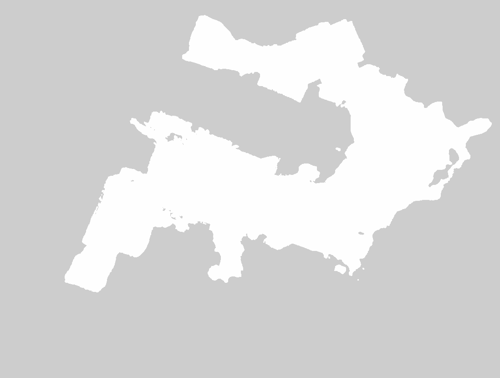
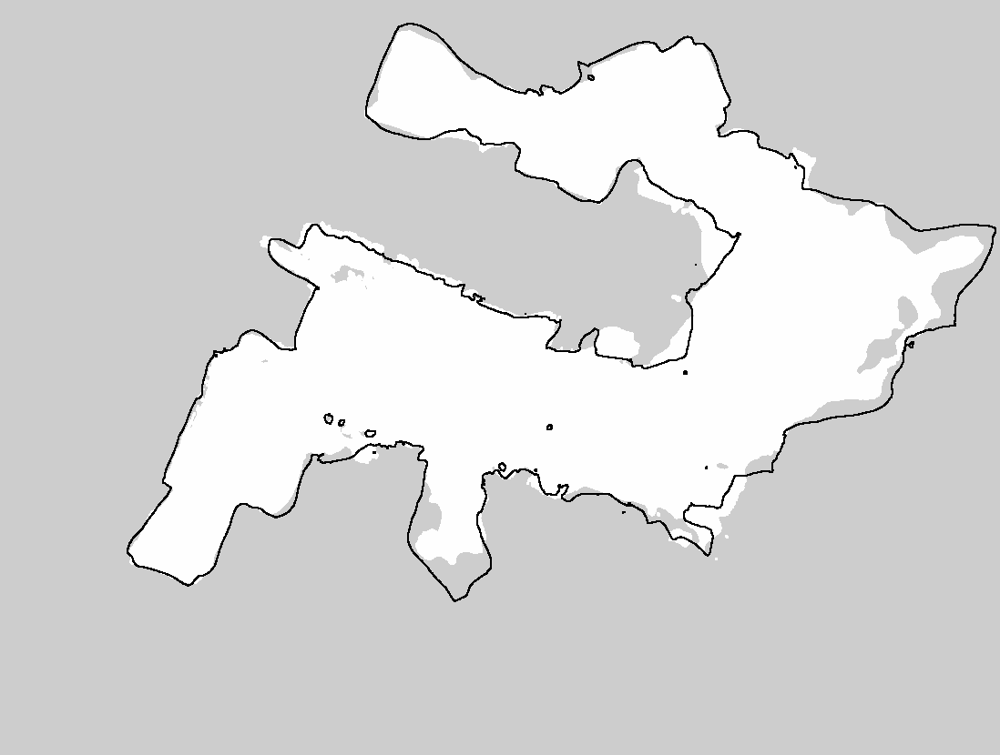
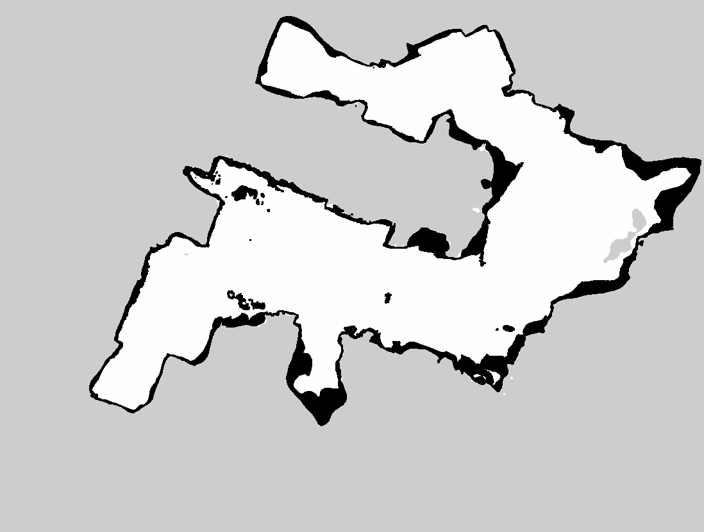

# map_builder

ROS 2 `ament_python` package for processing mesh/point cloud data (e.g., from photogrammetry) into ROS2 occupancy maps.

## Installation

This package uses Open3D for point-cloud processing and Trimesh for mesh
processing. These dependencies must be installed for the Python interpreter
which runs the tools. A virtual environment is useful when the required
versions are not available as system or ROS packages:

```bash
python3 -m venv --system-site-packages venv
source venv/bin/activate
python -m pip install -e .
```

The editable install installs dependencies from `setup.py` and places the
command-line tools in the virtual environment's `bin` directory. They can then
be run directly while the environment is active:

```bash
mesh_section_map --help
mesh_slab_map --help
pcd_preproc --help
pcd_filter --help
```

An editable pip install is sufficient when using the Python API or running the
tools directly. A colcon build is needed when the package must be discoverable
by ROS 2 or invoked through `ros2 run`. Launch colcon through the activated
virtual environment's Python so the generated ROS executables use the same
interpreter and can import Open3D and Trimesh:

```bash
source venv/bin/activate
python -m colcon build --packages-select map_builder --symlink-install
source install/setup.bash
ros2 run map_builder mesh_section_map --help
```

Using a bare `colcon build` may launch a system-installed colcon whose shebang
selects the system Python instead of the active virtual environment. Also note
that colcon does not install missing Python runtime dependencies; install them
with pip or the system package manager before building and running the tools.

## Pipeline

The processing stages accept and return Open3D tensor point clouds. File I/O is
kept outside the stages so they can be assembled into a larger pipeline:

```python
from map_builder.pcd_filter import filter_point_cloud
from map_builder.pcd_io import read_point_cloud, write_point_cloud
from map_builder.pcd_preproc import preprocess_point_cloud

pcd = read_point_cloud("input.ply")
pcd, preproc_result = preprocess_point_cloud(
    pcd,
    target_ceiling_height=2.4384,
)
pcd, filter_result = filter_point_cloud(pcd)
write_point_cloud("output.ply", pcd)
```

Each stage also has a file-based wrapper and ROS-installed CLI:

```bash
pcd_preproc input.ply preprocessed.ply --ceiling-height 2.4384
pcd_filter preprocessed.ply filtered.ply
```

## Mesh/point-cloud Rasterization

Let's say we have a robot with a 2d lidar and we have generated a 3d model (textured mesh + point cloud) of the robot's operating environment via photogrammetry. Think of this as a possible alternative to mapping the environment via SLAM. We want to create two maps: a 2D occupancy map at the lidar level for robot localization (e.g., via AMCL) and a 2D map of driveable space - i.e., a map of obstructed/free/unknown space across the robot's height footprint. The first map is generated by ```map_builder.mesh_processing.rasterize_mesh_section()```, and the second by ```map_builder.mesh_processing.rasterize_mesh_slab()```.

Mesh processing uses Trimesh and a shared `RasterGrid` world-coordinate
definition:

```python
from map_builder.mesh_processing import (
    load_and_transform_mesh,
    mesh_xy_bounds,
    rasterize_mesh_floor_free,
    rasterize_mesh_section,
    rasterize_mesh_slab,
)
from map_builder.occupancy_map import RasterGrid, write_ros_occupancy_map
from map_builder.pcd_io import read_point_cloud
from map_builder.pcd_preproc import preprocess_point_cloud

pcd = read_point_cloud("pointcloud.ply")
pcd, preproc_result = preprocess_point_cloud(
    pcd,
    target_ceiling_height=2.4384,
)

mesh = load_and_transform_mesh("model.obj", preproc_result)
grid = RasterGrid.from_bounds(mesh_xy_bounds(mesh), resolution=0.05)

floor_free_map = rasterize_mesh_floor_free(
    mesh,
    z_max_floor=0.05,
    grid=grid,
    voxel_scale=0.01,
)
section_map = rasterize_mesh_section(
    mesh,
    z_height=0.0,
    grid=grid,
    base_map=floor_free_map,
    footprint_width=grid.resolution,
)
slab_map = rasterize_mesh_slab(
    mesh,
    z_min=0.05,
    z_max=0.20,
    grid=grid,
    voxel_scale=0.05,
    base_map=floor_free_map,
)

write_ros_occupancy_map("section_map", section_map)
write_ros_occupancy_map("slab_map", slab_map)
write_ros_occupancy_map("floor_free_map", floor_free_map)
```

Passing the same `RasterGrid` to every rasterizer guarantees that identical
row/column indices refer to identical world XY areas. The grid origin is the
lower-left world coordinate. Internal raster rows increase with world Y; PNG
rows are flipped when written to match ROS `map_server` image conventions.

Mesh-derived maps mark detected geometry as occupied and leave all other cells
unknown. `PreprocessResult.source_to_processed_transform` is the exact 4x4
transform used for point-cloud floor alignment and scaling.
`load_and_transform_mesh` applies that transform to the mesh, placing both data
sources in the same coordinate frame before creating a shared grid.

The floor-free stage is complementary: it starts unknown everywhere, selects
upward-facing mesh surfaces within `+/- z_max_floor`, and marks their projected
cells free. It never marks occupied cells. Section and slab rasterization accept
this result as `base_map`, copy its free/unknown values, and overwrite detected
geometry as occupied without mutating the floor map.

Section edges use a square footprint one map cell wide by default. This expands
zero-width section lines across grid boundaries in the same conservative manner
as slab voxel footprints. Override it with `footprint_width` or the
`mesh_section_map --footprint-width` option.

The complete repeated workflow is available through
`prepare_mesh_map_context`, `generate_section_map`, and `generate_slab_map`.
The installed (see the installation section above - you may also wish to use `ros2 run`) section/slab executables accept a mesh, point cloud, known
ceiling height, output basename, and map parameters:

```bash
mesh_section_map model.obj cloud.ply output/map \
  --ceiling-height 2.0 \
  --section-height 1.0 \
  --resolution 0.05 \
  --padding 0.5

mesh_slab_map model.obj cloud.ply output/map \
  --ceiling-height 2.0 \
  --z-min 0.05 \
  --z-max 1.0 \
  --voxel-scale 0.05 \
  --resolution 0.05 \
  --padding 0.5
```

## Simulated Room Fixtures

`map_builder.sim_room.write_sim_room_fixtures` generates a compact deterministic
test room:

- closed inward-facing OBJ mesh
- floor at `z=0`
- ceiling at `z=2`
- walls at `x/y = +/-2`
- PLY point cloud sampled at approximately `0.1 m`

The generated fixtures are retained as `data/sim_room.obj` and
`data/sim_room.ply`. Sim occupancy tests use a lidar height of `1.0 m` and a
`0.5 m` grid padding so their outputs contain unknown cells outside the room.
The complete sim suite mirrors fixture generation, preprocessing, filtering,
floor-free, section, and slab stages and runs in under a second.

## Running Tests

Tests depend on mesh/point-cloud files in `data/`. There is a small fixture
generated by `write_sim_room_fixtures` in `data/sim_room.ply` and `data/sim_room.obj`.
This code was tested against a larger dataset originally in `data/metashape_pointcloud.ply` and `data/metashape_model.obj`. These datasets are not included in the repository due to the large file size.
Routine discovery runs the compact sim suite and small unit tests.

Functional-test outputs are retained under `test_output/`. Mesh functional tests retain their raw occupancy
rasters as `.npy` and ROS-compatible `.png`/`.yaml` pairs.

This package intentionally follows the same plain `tests/` directory layout as
`mapping_data_collector`: the test files are standalone modules, not a Python
package.

For PyCharm, remember to set the tests directory as a source directory.

## Some results

The `test_output/` directory contains some example results. One set is associated with the sim suite (see above). The other is a test of the mesh rasterizer tools on a real world example. The real world example is a 3D model (mesh + point cloud) of a single-floor dwelling, captured via photogrammetry from an Insta360 camera. 

First, point cloud processing uses RANSAC to locate the floor and ceiling of the single-floor dwelling. The model and point cloud are then scaled and translated. The output raster is initialized to unknown everywhere and then the mesh is processed to find flat mesh near the floor. The near-floor flat mesh is then projected to the 2D output raster as unoccupied cells. This occupancy map has no occupied cells, just unoccupied (white) or unknown (gray):



Next, the mesh is processed at the 2D lidar height to create a map for localization:



Note that this map is combined with the floor map to fill in unknown cells (gray). Finally, the mesh is processed to pull out mesh above the floor but below the robot's height. This is projected and rasterized to create:



And so, in principle, we have a navigation map and a driveable area/hazard map. These can be ingested into ROS2 nodes for localization and navigation.

Note that meshes obtained by photogrammetry can be quite noisy in feature-poor regions. Some combination with Lidar can improve the results. Good lighting and processing tweaks can also greatly improve photogrammetry results.

## AI assistance

This repo was developed via iterative interaction with both ChatGPT (version 5.5, OpenAI 05/2026 - 06/2026) and Codex (OpenAI, 05/2026 - 06/2026). See `codex_instructions*.txt` for some example major instructions/prompts.
